# 无线接入网监听

### 无线网络连接过程
- AP定时广播Beacon帧
- STA发送Probe Request帧
- AP回复Probe Response帧
- STA发送Authentication Request请求身份认证
- AP回复Authentication Response帧
- STA发送Association Request请求连接
- AP回复Association Response帧

### 抓包过程并对包进行处理
- 设置wlan0工作在监听模式
```
  airmon-ng start wlan0
```
 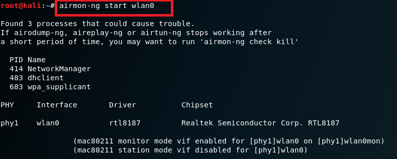
- 检查无线网卡是否已处于启用状态
```
  ifconfig
```
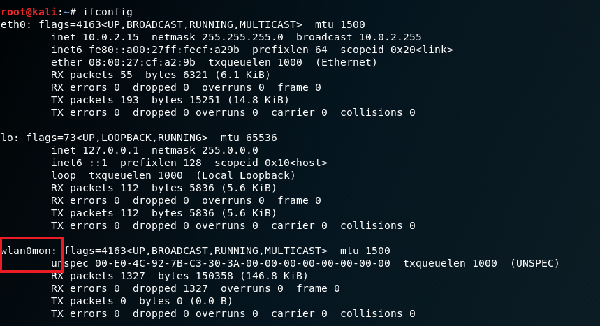
- 检查无线网卡是否已切换到监听模式
```
  iwconfig
```
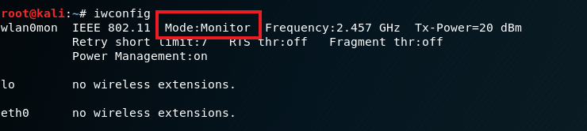
- 定向监听并将结果保存到本地文件929
```
  airodump-ng wlan0mon -w 929 --beacons
```
- 查看当前目录下，监听结果是否已经保存到本地
```
  ls -1
```
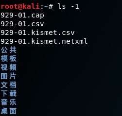
- 提取Beacon帧的SSID信息
```
tshark -r 929-01.cap -Y wlan.fc.type_subtype==0x08 -T fields -e wlan.sa -e wlan.fixed.capabilities.privacy -e wlan.ssid | sort -d -u > beacon.list
```
```
14:75:90:e1:7b:84	0	TP-LINK_����
30:99:35:6a:31:69	1	CU_E37p
80:f6:2e:dc:63:f0	0	ChinaNet
9c:6f:52:6d:ee:c9	1	CU_H44H
9c:6f:52:6d:ef:50	1	CU_t4Qd
9c:6f:52:6e:20:a3	1	CU_DTxK
9c:6f:52:6e:22:5c	1	CU_PqqT
9c:6f:52:6f:05:4b	1	CU_fPqv
a6:50:46:7f:c1:18	1	XXXXX
b8:3a:08:5e:d6:c1	1	FLB
c8:64:c7:23:57:55	0	CMCC-WEB
da:64:c7:23:57:55	1	CMCC
ea:64:c7:23:57:55	0	and-Business
f4:83:cd:57:ae:b9	1	TP-LINK_AEB9
```
- 提取Probe Response的SSID信息
```
tshark -r 929-01.cap -Y wlan.fc.type_subtype==0x05 -T fields -e wlan.sa -e wlan.fixed.capabilities.privacy -e wlan.ssid| sort -d -u > probe.list
```
```
80:f6:2e:dc:63:f0	0	ChinaNet
9c:6f:52:6d:ee:c9	1	CU_H44H
9c:6f:52:6d:ef:50	1	CU_t4Qd
a6:50:46:7f:c1:18	1	XXXXX
c8:64:c7:23:57:55	0	CMCC-WEB
da:64:c7:23:57:55	1	CMCC
ea:64:c7:23:57:55	0	and-Business
```
- 将Beacon中提取的SSID和Probe Response的SSID值合并，并去重
```
sort -m probe.list beacon.list | sort -k3 -u > ssid.list

```
```
ea:64:c7:23:57:55	0	and-Business
80:f6:2e:dc:63:f0	0	ChinaNet
da:64:c7:23:57:55	1	CMCC
c8:64:c7:23:57:55	0	CMCC-WEB
9c:6f:52:6e:20:a3	1	CU_DTxK
30:99:35:6a:31:69	1	CU_E37p
9c:6f:52:6f:05:4b	1	CU_fPqv
9c:6f:52:6d:ee:c9	1	CU_H44H
9c:6f:52:6e:22:5c	1	CU_PqqT
9c:6f:52:6d:ef:50	1	CU_t4Qd
b8:3a:08:5e:d6:c1	1	FLB
14:75:90:e1:7b:84	0	TP-LINK_����
f4:83:cd:57:ae:b9	1	TP-LINK_AEB9
a6:50:46:7f:c1:18	1	XXXXX
```
### 问题讨论
- **查看统计当前信号覆盖范围内一共有多少独立的SSID？其中是否包括隐藏SSID？哪些无线热点是加密/非加密的？加密方式是否可知？**
  - 独立的SSID。<br>
    AP不定时广播的Beacon帧中存在SSID信息，发送的Probe Response帧中也存在SSID信息。隐藏的SSID是通过在广播的Beacon帧中将SSID信息填写为若干\x00或不广播beacon帧但回复Probe Response帧来实现的。<br>
    因此，要找到所有独立的SSID必须结合Beacon帧和Probe Response帧的SSID信息一起来看，在++本实验++中提取到ssid.list中的SSID信息就是所有独立的SSID。(因为本实验中没有隐藏的SSID，若存在隐藏的SSID，在重名合并的机制下会将两个相互独立的隐藏SSID合并为一个SSID。因此若存在隐藏SSID，要先找到所有隐藏SSID，再去分析所有独立的SSID的个数)<br>
    通过```wc -l ssid.list```指令来统计ssid.list的行数,可以看出有14个独立的SSID<br>
    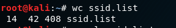<br>
  - 隐藏的SSID<br>
    - 在本实验中并没有抓到隐藏的SSID。<br>
    - 找到隐藏SSID的方法：用wiresshark打开之前的929.cap文件，在beacon.list中找到一个SSID值++显示++为空的MAC地址，将此MAC地址作为wireshark的过滤条件，查看其SSID值(为空)和set值(为wildcard SSID或一般为若干个\000 [参考了jckling的实验截图](https://github.com/CUCCS/2018-NS-Public-jckling/blob/56c7a202aa9c3ab8a38ce402026f6be7a9433ae1/mis-0x02/第二章实验练习题.md))
    - (下面以某一个抓到的非隐藏SSID为例，展示要查看的值)<br>
    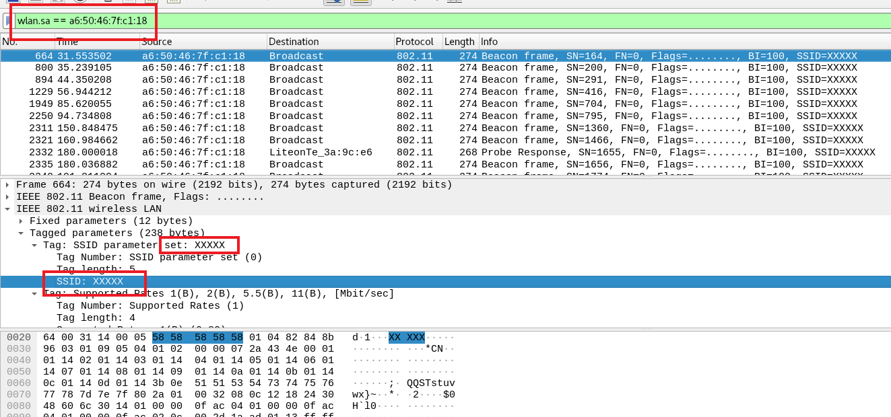<br>
  - 判断无线热点加密/非加密
    - 无线热点是否加密可以通过查看Beacon帧的wlan.fixed.capabilities.privacy字段来判断：0是未加密，1是加密
    - Beacon帧的过滤：wlan.fc.type==0x08
    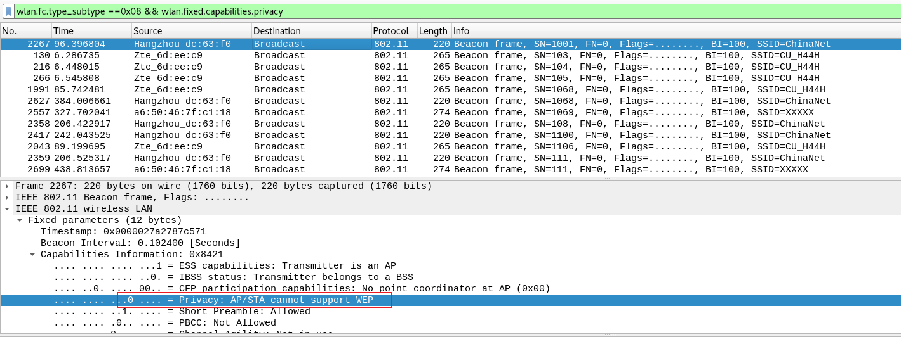<br>
    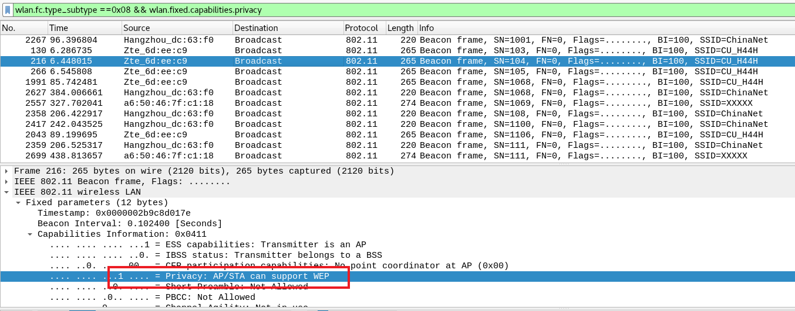<br>
  - 加密方式
    - 加密方式可以通过wlan.fixed.auth.alg来识别，但在本实验中，所抓到的包都没有包含这个字段，所以用wireshark过滤并没有结果。<br>
    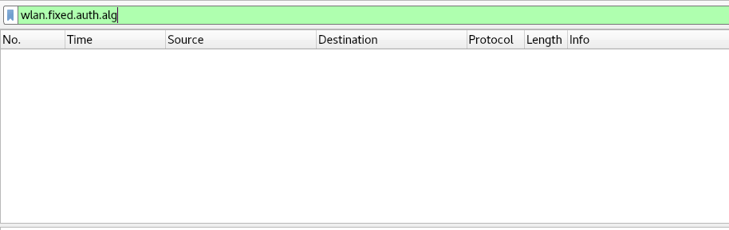<br>
- **如何分析出一个指定手机在抓包时间窗口内在手机端的无线网络列表可以看到哪些SSID？这台手机尝试连接了哪些SSID？最终加入了哪些SSID？**
  - 手机端的无线网络列表
    手机端通过侦听AP定期发送的Beacon Frame来发现BSS，最终出现在手机端的SSID列表上，在这种方式下，STA几乎无需付出扫描代价，因此称为被动扫描。在这种方式下，STA几乎无需付出扫描代价，因此称为被动扫描。
  - 手机尝试连接了哪些SSID
  　通过Probe　Request帧来查看手机尝试和曾经连接了哪些WiFi<br>
　　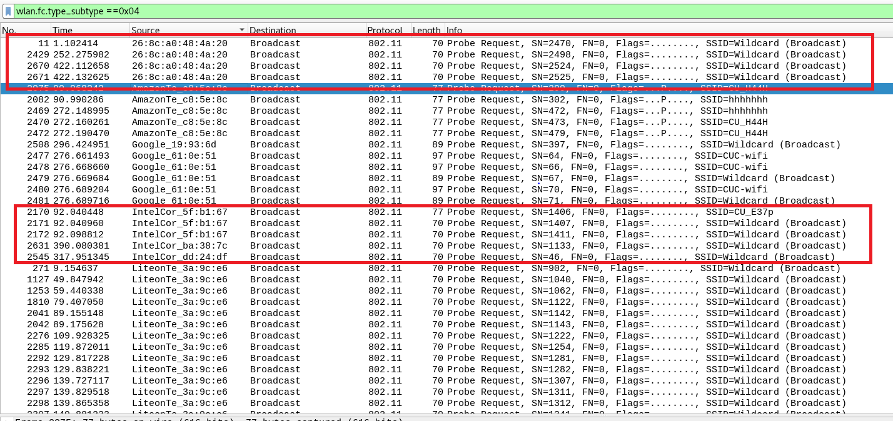<br>
  - 手机最终加入了哪些SSID
    通过Association Request和Association Resposne帧的status code字段来确定手机最终加入了哪些SSID。本次试验中，因为抓包的偶然性，并没有抓到Association相关的帧，所以并不能看出手机最终加入了哪些SSID。
- **SSID包含在哪些类型的802.11帧？**<br>
  从实验结果看：<br>
   Beacon<br>
   Probe response<br>
   Probe request<br>
    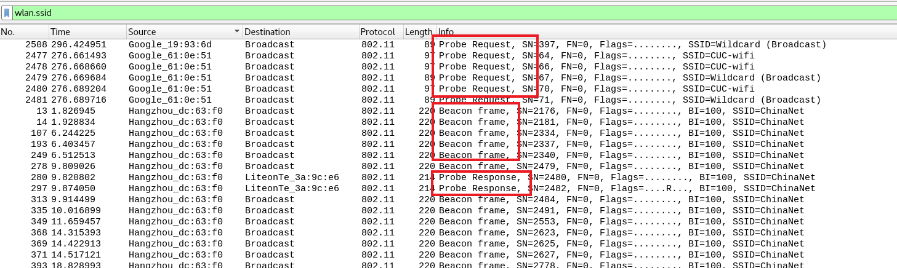<br>
  从资料来看还有：<br>
  Association Reqeust
### 参考链接
[802.11 学习笔记](https://www.binss.me/blog/notes-of-802.11-protocal/)<br>
[2018-NS-Public-jckling](https://github.com/CUCCS/2018-NS-Public-jckling/blob/56c7a202aa9c3ab8a38ce402026f6be7a9433ae1/mis-0x02/第二章实验练习题.md)<br>
[2018-NS-Public-TheMasterOfMagic](https://github.com/CUCCS/2018-NS-Public-TheMasterOfMagic/blob/6a0375bef1853cab614c466d0952e36918904b62/mis/mis-chap0x02.md)<br>
[移动互联网安全 第二章实验](https://sec.cuc.edu.cn/huangwei/textbook/mis/chap0x02/exp.html)