# 基于VirtualBox的网络攻防基础环境搭建

## 实验要求
- **节点**：靶机（target）、网关（gateway）、攻击者主机（attacker）
- **连通性** 
  - 靶机可以直接访问攻击者主机
  - 攻击者主机无法直接访问靶机
  - 网关可以直接访问攻击者主机和靶机 
  - 靶机的所有对外上下行流量必须经过网关
  - 所有节点均可以访问互联网
- **其他要求** 
  - 所有节点制作成基础镜像（多重加载的虚拟硬盘）

## 实验拓扑图
   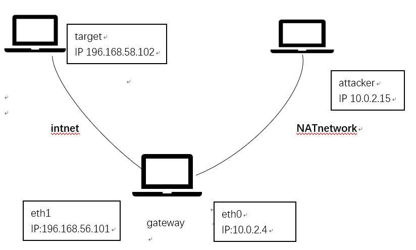<br>

## 实验步骤
- **安装虚拟机**<br>
  - 先安装一台纯净的kali虚拟机并将其转换成多重加载，在此基础上用多重加载的方式安装三台gateway，target，attacker的kali虚拟机。<br>
   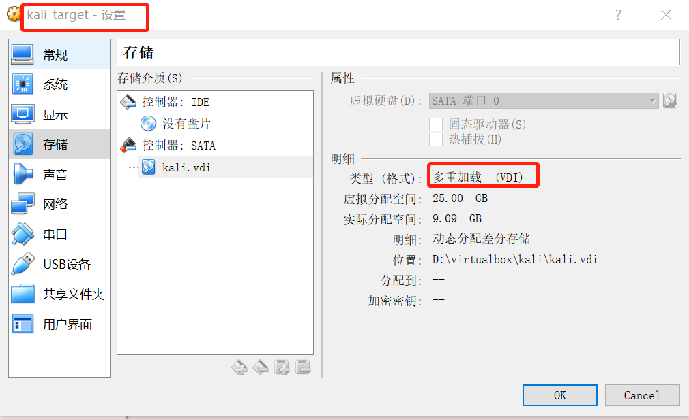<br>
   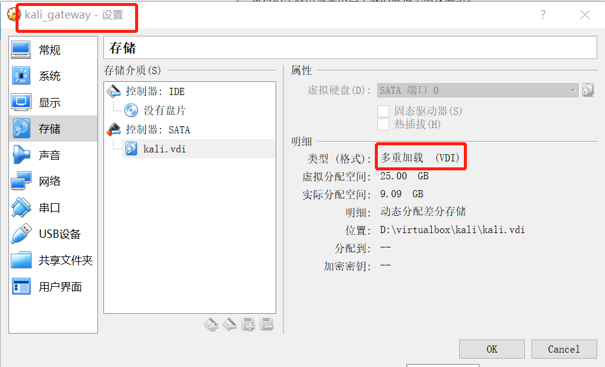<br>
   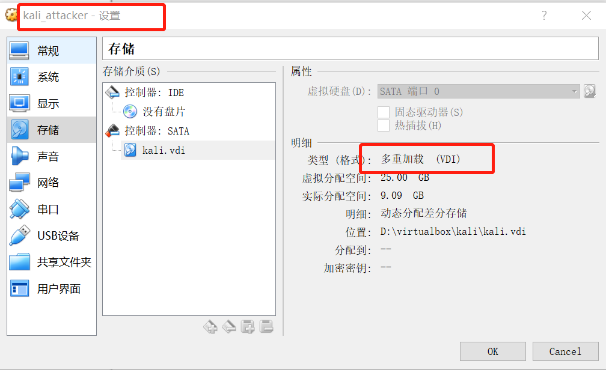<br>
- **网络设置**
   - 因为target和gateway要能直接访问，且target的所有对外上下行流量必须经过网关，所以在target和gateway之间建立一个不能访问互联网的内部网络，可以选用host-only或intnet网络模式，在这里选择intnet。给target和gateway的eth1网卡都设置成intnet。
   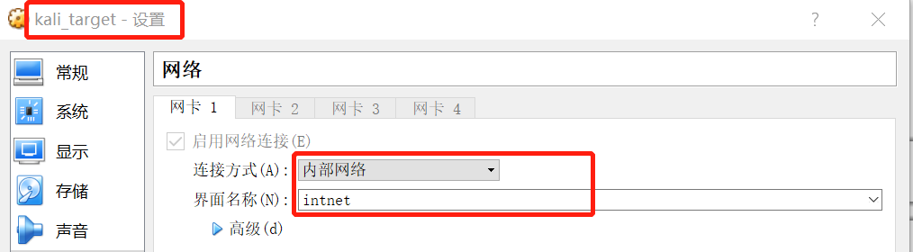<br>
   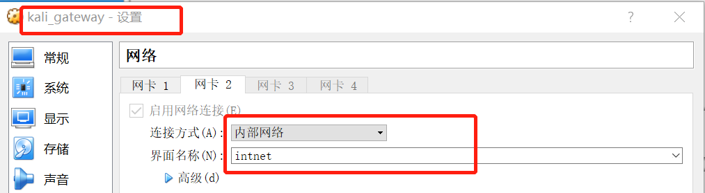<br>
   - 因为gateway和attacker要能直接访问，且两者都能上网，所以选用NAT network 模式。给attacker和gateway的eth0的网卡都设置成NAT network。
   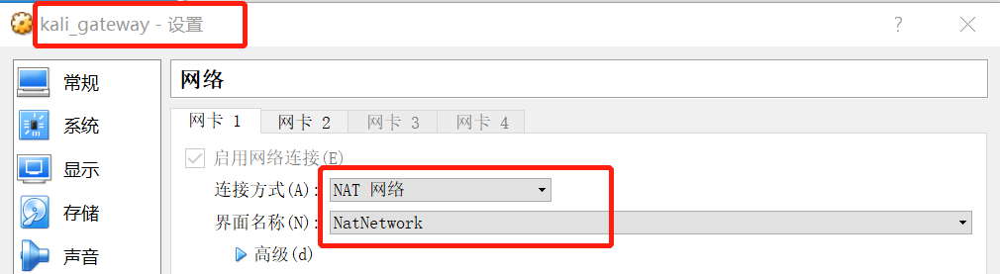<br>
   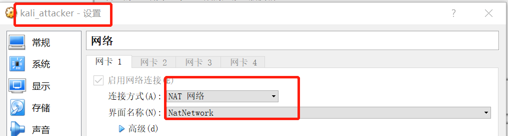<br>
- **设置IP**
  - target：target设置的是intnet，没有DHCP服务器，所以必须自己分配IP和掩码。且要求target的所有流量都要经过gateway，所以要再设置默认网关。在```/etc/network/interfaces```文件里添加以下内容
  ```    
       allow-hotplug eth0
       iface eth0 inet static
       address 196.168.56.102
       netmask 255.255.255.0
       gateway 196.168.56.101
  ```
  - 使用```ifconfig```查看虚拟机IP地址<br>
  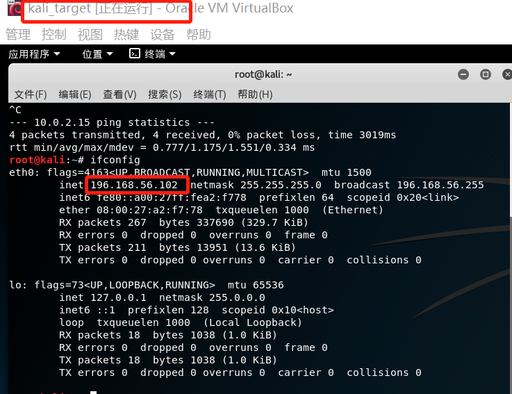<br>
  - gateway：gateway的eth1和target一样都是intnet模式，所以同样的方法配置ip地址和掩码。eth0是NAT network模式，会自动分配ip地址。==但要注意，kali默认是只开启一个网卡的，所以在配置里面要开启双网卡==<br>
  ```    
       allow-hotplug eth0
       iface eth0 inet DHCP
       allow-hotplug eth1
       iface eth0 inet static
       address 196.168.56.101
       netmask 255.255.255.0
  ``` 
  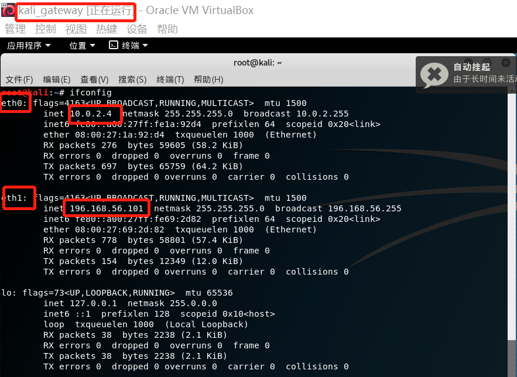<br>
  - attacker：attacker是是NAT network模式，会自动分配ip地址<br>
  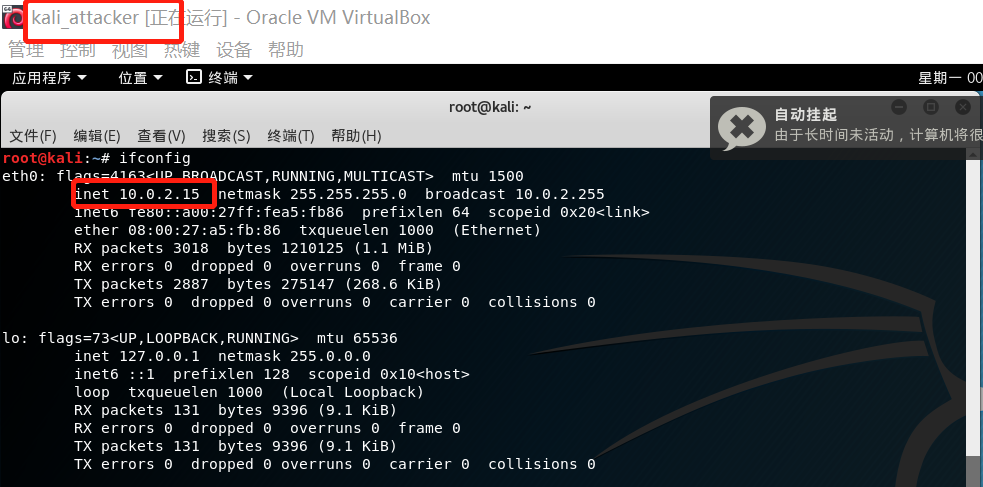<br>
  - 这时，gateway可以pingtarget和attacker。
- **gateway进行ipv4转发、路由表和NAT设置**
  - 开启ipv4转发，让gateway的两个端口可以转发IP包。在gateway的```/proc/sys/net/ipv4/ip_forward```文件里面写上```1```,或者直接在命令行输入 
  ```
    echo 1 > /proc/sys/net/ipv4/ip_forward
  ```
    并对```/etc/sysctrl.conf```文件里的```net.ipv4.ip_forward=1```这一行取消注释。
  [参考](https://blog.csdn.net/yuanbinquan/article/details/76228312)
  - 配置路由表，添加一条路由：目标地址是10.0.2.0/24这一网段的消息由eth0进行转发。[参考](https://computingforgeeks.com/different-ways-of-configuring-static-routes-in-linux/)<br>
  ```
   route add -net 10.0.2.0 netmask 255.255.255.0 dev eth0
  ```
  使用```route -n```查看路由表<br>
  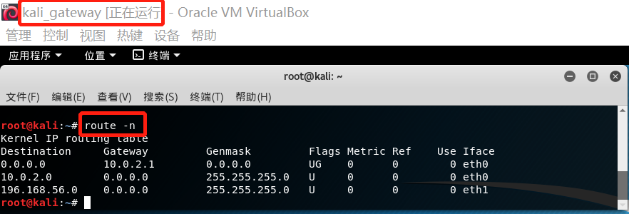<br>
  - NAT网络地址转换设置。在未配置NAT之前，eth0转发ip包原地址仍然是靶机的IP地址，进行了设置之后，eth0转发后源地址改成eth0的IP地址。使用以下命令配置NAT<br>
  ```
    ipatables -t nat -A POSTROUTING -o eth0 -s 196.168.56.0/24 -j MASQUERADE
  ```
  查看NAT table<br>
   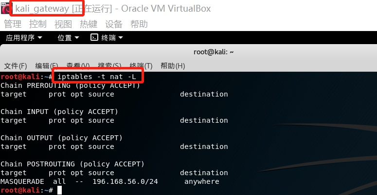<br>
- **网关配置DNS域名服务器**
   - 这时，gateway和target都可以ping网络的IP地址，但是不能直接ping域名，是因为没有配置域名解析服务器。
   在文件```etc\resolv.conf```文件里面填写一个公共服务器，这里写的是谷歌公共服务器<br>
    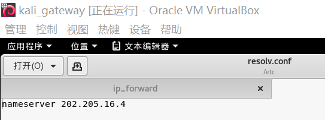<br>
## 实验结果
- [x]   target可以直接访问attacker<br>
    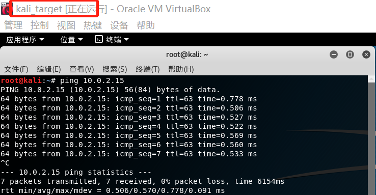<br>
- [x]   attacker不能直接访问target<br>
    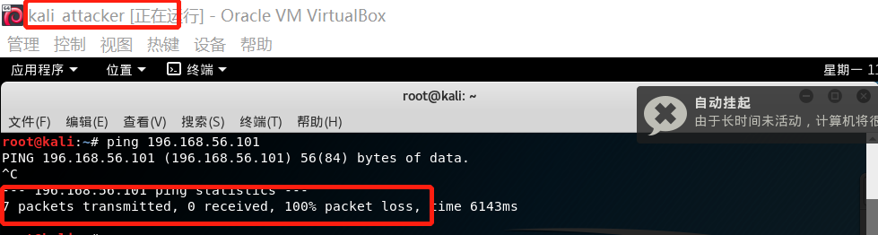<br>
- [x]   gateway可以直接访问target和attacker<br>
    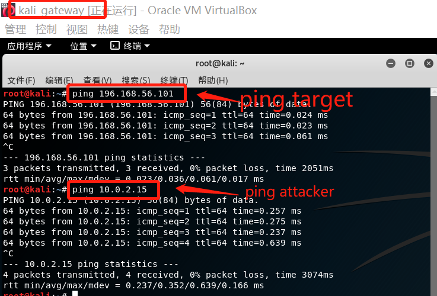<br>
- [x]   target所有上下行流量都经过gateway<br>
    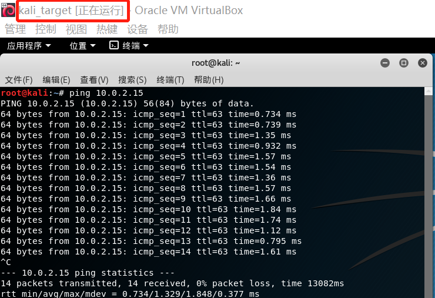<br>
    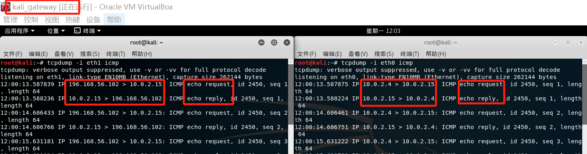<br>
- [x]   所有节点都可以访问互联网<br>
    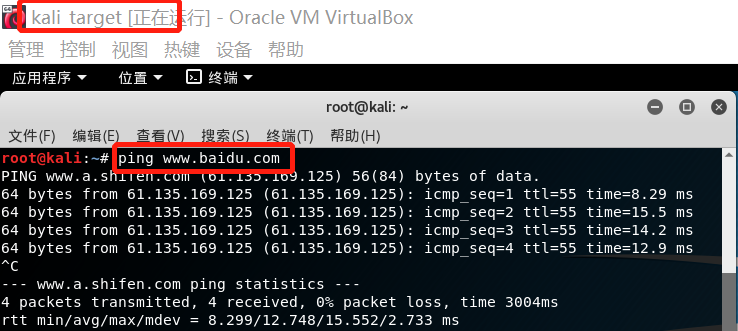<br>
    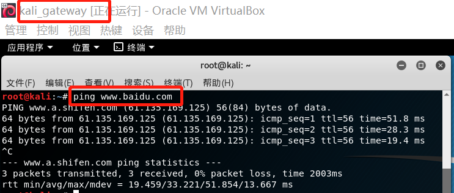<br>
    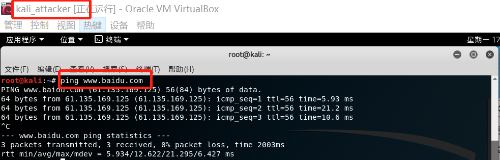<br>
- [x]   三台虚拟机设置成多重加载
    - 在实验步骤的第一步安装虚拟机可以看出三台虚拟机已设置成多重加载
## 实验问题
   - **host-only网络模式和intnet网络模式的选择**。刚开始实验时选择了host-only。在配置完成后，在attacker ping target时，本应该不成功，但是却成功了。在gateway的两个端口监听并没有流量经过。tracerouter路径之后发现，ping request包时通过NAT network网络的网关传到target的。<br>
   解决方法：在宿主机上找到NAT network虚拟网卡，禁用 IP 转发或部署防火墙规则禁止从攻击者主机的数据包进入靶机的 Host-only 网络。但是我在宿主机上并没有找到NAT network的虚拟网卡，ifconfig也没有显示，只发现了host-only的虚拟网卡。为了以后方便进行实验和网络拓扑，我选择将host-only换成intnet网络。
   - **网关转发问题**。在target ping attacker时，设置好ipv4转发之后gateway仍不能将包转发给attacker。是因为没有添加路由，gateway不知道应该把这个包转发给谁就扔掉了。且添加路由之后还要配置NAT才能上网。
