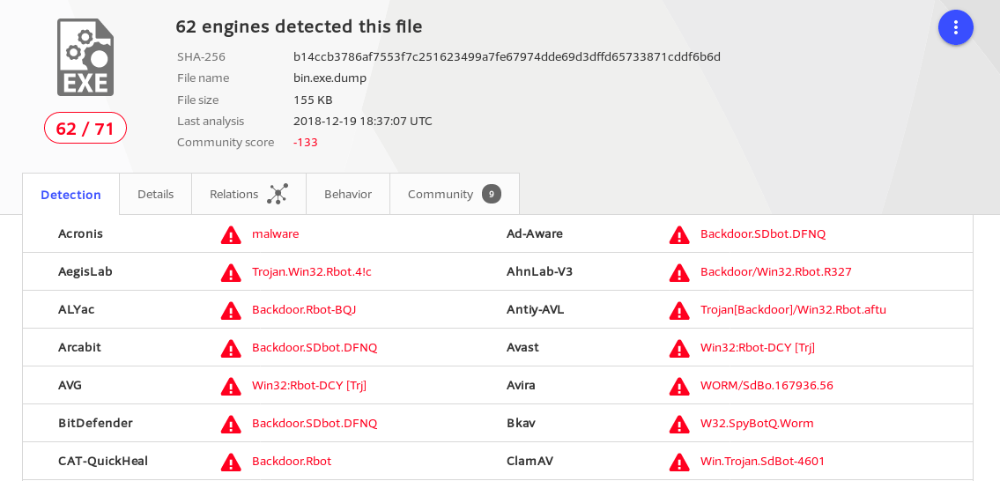

## 实战Bro网络入侵取证

### 安装Bro

```
apt-get install bro bro-aux
```

### 实验环境基本信息
- 进入`/usr/share/bro/site`目录执行执行具体指令查看环境信息<br>


### 编辑bro配置文件
- 编辑`/etc/bro/site/local.bro`,在文件尾部追加代码

```
@load frameworks/files/extract-all-files
@load mytuning.bro
```
- 在`/etc/bro/site/`目录下创建新文件`mytuning.bro`,内容为：

```
redef ignore_checksums = T;
bro -r attack-trace.pcap /etc/bro/site/local.bro # 下文在使用bro对pcap包进行分析时若不加这一行会出现警告信息，添加上述一行变量定义除了bro运行过程中不会产生警告信息之外，对于本次实验来说会新增2个日志文件，会报告在当前流量（数据包文件）中发现了本地网络IP和该IP关联的已知服务信息。
```

### 使用bro自动化分析pcap文件
- 执行指令：
```
bro -r attack-trace.pcap /etc/bro/site/local.bro
```
- 可以看到pcap包目录下多了一些`.log`文件和一个`extract_files`文件夹，`extract_files`文件夹里面还有一个`extract-1240198114.648099-FTP_DATA-FHUsSu3rWdP07eRE4l`<br>

- 将`extract-1240198114.648099-FTP_DATA-FHUsSu3rWdP07eRE4l`文件上传到[virustotal](https://virustotal.com/)发现匹配了一个历史扫描报告

- 开始进行逆向推导，寻找入侵线索。
- 阅读`/usr/share/bro/base/files/extract/main.bro`的源代码，可以知道文件名的最后一部分是id,就是`files.log`文件的文件的唯一标识，也就是`FHUsSu3rWdP07eRE4l`

- 查看`files.log`文件，发现该文件提取自网络会话标识为`Cgb2QW5C2BWsvESnc`的FTP会话

- 在conn.log中可以找到`Cgb2QW5C2BWsvESnc`会话标识，定位具体的IP地址：`98.114.205.102`

