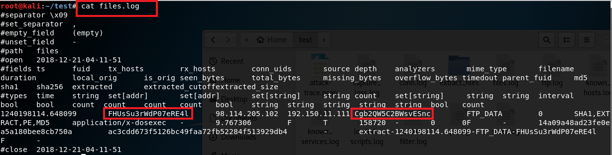
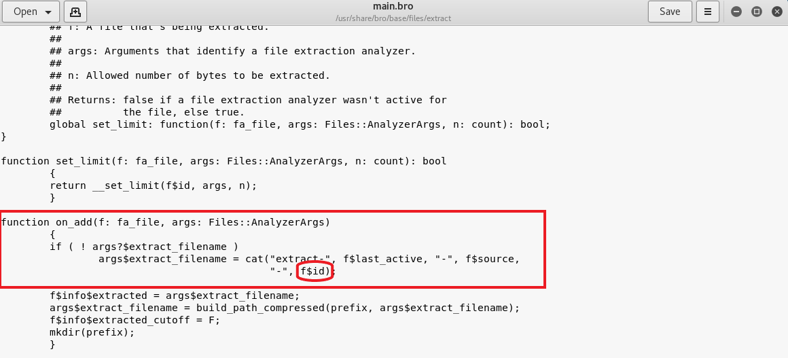

# 网络扫描

### 准备工作
- 将实验1中的NAT网络换成intnet, 手动为attacker的eth0配置IP,掩码和网关，网关和target网关一样。
```
  allow-hotplug eth0
  iface eth0 inet static
  address 196.168.56.103
  netmask 255.255.255.0
  gateway 196.168.56.101
```

### 实验环境
- attacker：196.168.56.103
- target：196.168.56.102
- gateway: 196.168.56.101

### TCP connect scan
- 检查target的80端口，处于关闭状态<br>

- 在attacker执行tcp_connect_scan.py，并在target中捕获接受的包保存在tcp_connect_scan.cap中.
- attacker执行结果显示端口关闭<br>

- target中用wireshark打开捕获的包

- 在target开启apache, 并检查target的80端口，处于监听状态
```
  systemctl start apache2
  netstat -apn |grep 80
```

- 在attacker里执行tcp_connect_scan.py，输出结果80端口是open<br>

- 在target里打开tcp_connect_scan.cap,发现里面确实有三次握手：SYN;SYN,ACK;RST,ACK


- [tcp_connect_scan.py代码](pycode/tcp_connect_scan.py)

### TCP stealth scan
- target的80端口关闭和开启监听时分别在attacker执行tcp_stealth_scan.py


- 当target80端口打开且attacker执行tcp_stealth_scan.py时，在target监听eth0,并将监听结果写入tcp_stealth_scan.cap中,在wireshark打开，可以看到有三次握手<br>

- 当target80端口关闭时，可以看到只有两次握手，最后一次是RST回复

- [tcp_stealth_scan.py代码](pycode/tcp_stealth_scan.py)

### TCP XMAS scan
- target的80端口关闭和开启监听时分别在attacker执行tcp_XMAS_scan.py

- 当target的80端口打开时，可以看到抓到的包没有回应，则可以判断target80端口是打开的

- 当target的80端口关闭时，可以看到抓到的包有RST回复，则可以判断target的80端口是关闭的

- [tcp_XMAS_scan.py代码](pycode/tcp_XMAS_scan.py)

### UDP scan
- target的80端口处于关闭状态时在attacker执行UDP_scan.py，在target监听eth0,并将监听结果写入UDP_scan.cap中


- 在target开启53端口，并在attacker执行UDP_scan.py
```
  uc -ulp 53 
```


- 使用`uc -u -l -p 53 < /etc/passwd`来开启UDP端口，UDP_scan.py的` elif (udp_scan_resp.haslayer(UDP))`: 为 `elif (udp_scan_resp.haslayer(UDP) or udp_scan_resp.getlayer(IP).proto == IP_PROTOS.udp:`,发现attacker显示UDP端口为open状态<br>


- `uc -u -l -p 53 < /etc/passwd` 表示开启UDP端口，如果有人来连接UDP端口，就把etc/passwd文件的内容发回去。这样，我们就可以判断UDP端口是否是开启的了。
- elif判断条件的修改是因为，有可能UDP回复包太大，会被切分成几个IP包，但proto字段的值仍是udp。所以只判断回复包是否是UDP是不完整的，要考虑分段的情况。

[UDP_scan.py代码](pycode/UDP_scan.py)

### 批改总结
- TCP Connect端口扫描的代码里，收到目标端口回应SYN/ACK报文后，直接发送了一个同时设置了ACK+RST标志位的TCP响应报文，我认为这里是在完成三次握手的同时断开连接。所以三次握手的过程应该是完整的。
- tcp_stealth_scan.py 和 tcp_connect_scan.py 构造的 SYN 探测报文代码一模一样，都是 sr1(IP(dst=dst_ip)/TCP(sport=src_port,dport=dst_port,flags="S"),timeout=10)，但在收到同样的响应报文类型为 <type 'NoneType'> 时，前者 print "Closed" ，而后者 print "Filtered"。根据tcp_stealth scan的过程，我认为tcp_stealth是一种半开放扫描，所以如果端口是被过滤状态则没有响应。