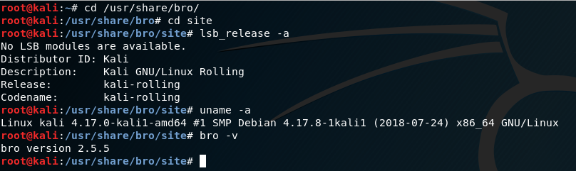

# 网络扫描

### 准备工作
- 将实验1中的NAT网络换成intnet, 手动为attacker的eth0配置IP,掩码和网关，网关和target网关一样。
```
  allow-hotplug eth0
  iface eth0 inet static
  address 196.168.56.103
  netmask 255.255.255.0
  gateway 196.168.56.101
```

### 实验环境
- attacker：196.168.56.103
- target：196.168.56.102
- gateway: 196.168.56.101

### TCP connect scan
- 检查target的80端口，处于关闭状态<br>

- 在attacker执行tcp_connect_scan.py，并在target中捕获接受的包保存在tcp_connect_scan.cap中.
- attacker执行结果显示端口关闭<br>

- target中用wireshark打开捕获的包

- 在target开启apache, 并检查target的80端口，处于监听状态
```
  systemctl start apache2
  netstat -apn |grep 80
```

- 在attacker里执行tcp_connect_scan.py，输出结果80端口是open<br>

- 在target里打开tcp_connect_scan.cap,发现里面确实有三次握手：SYN;SYN,ACK;RST,ACK


- [tcp_connect_scan.py代码](pycode/tcp_connect_scan.py)

### TCP stealth scan
- target的80端口关闭和开启监听时分别在attacker执行tcp_stealth_scan.py


- 当target80端口打开且attacker执行tcp_stealth_scan.py时，在target监听eth0,并将监听结果写入tcp_stealth_scan.cap中,在wireshark打开，可以看到有三次握手<br>

- 当target80端口关闭时，可以看到只有两次握手，最后一次是RST回复

- [tcp_stealth_scan.py代码](pycode/tcp_stealth_scan.py)

### TCP XMAX scan
- target的80端口关闭和开启监听时分别在attacker执行tcp_XMAX_scan.py

- 当target的80端口打开时，可以看到抓到的包没有回应，则可以判断target80端口是打开的

- 当target的80端口关闭时，可以看到抓到的包有RST回复，则可以判断target的80端口是关闭的

- [tcp_stealth_scan.py代码](pycode/tcp_XMAX_scan.py)

### UDP scan
- target的80端口处于关闭状态时在attacker执行UDP_scan.py，在target监听eth0,并将监听结果写入UDP_scan.cap中


- 在target开启53端口，并在attacker执行UDP_scan.py
```
  uc -ulp 53
```


[UDP_scan.py代码](pycode/UDP_scan.py)